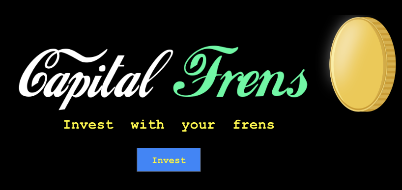
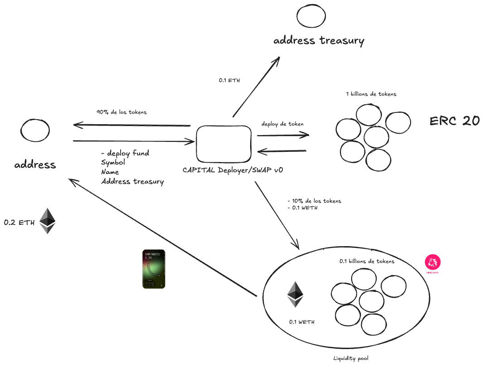

# CAPITAL FRENS

<div align="center">
  
</div>

<div align="center">
<a href="https://hey.xyz/u/capitalfrens">
📱 Lens Profile
</a>
</div>

## The Problem

Traditional investment lacks accessibility and transparency in Latin America. Retail investors need more sophisticated and democratic tools to participate in meaningful collective investments.

Centralization and censorship in traditional social networks limit freedom of expression and the ability to build genuine financial communities.

## The Solution

Capital Frens is a decentralized, social-first investment fund that offers:

- Collective investment through the $CAPITAL token
- Native integration with the Lens ecosystem
- Democratic decision-making through Lens profiles
- Rewards for creators and developers

## Architecture

### Flow Diagram



### Dependencies

- Node.js 22+
- TypeScript
- Lens SDK
- Lens Protocol

## Project Structure

```
capital-frens/
├── assets/
└── README.md
```

## Team

- Nico Capital (Chile) - Founder
- Manuel Elias (Bolivia)
- Matias (Argentina)

## Contact

- Lens: [@capitalfrens](https://hey.xyz/u/capitalfrens)
- Twitter: [@Manueliasweb3](https://twitter.com/Manueliasweb3), [@oydual3](https://twitter.com/oydual3)
